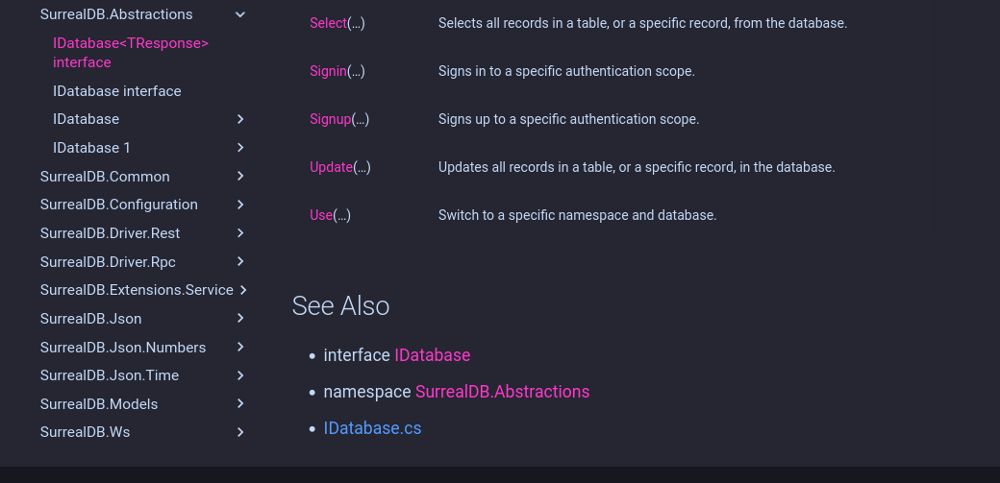

# XmlDocMarkdown

Generates Markdown from .NET XML documentation comments.

[](https://github.com/ProphetLamb/XmlDocMarkdown/actions?query=workflow%3ABuild)

This is a fork of [ejball/XmlDocMarkdown](https://github.com/ejball/XmlDocMarkdown) (which seems to be dead).

## Fork

This is fork implement support for source symbols mappings, in order to determine source file locations. [Steve Gilham](https://github.com/SteveGilham/XmlDocMarkdown/tree/develop/issue-81)s fork implements a similar solution to this problem, but the appoach taken fails when there is no methodbody in a type (e.g. interfaces, markers or abstract classes). Which is the case for a [Surreal.Net](https://github.com/ProphetLamb/Surreal.Net) the issue results in nonsensical code references:



The referenced file at `/src/Abstractions/IDatabase.cs` does not exist. It is named `Database.cs` and contains the generic and non-generic interface `IDatabase`. While it would be trivial to rename the file, I bow to no tool and we have the same issue for other tiny classes which populate a single file.

### Existing solution

[Steve Gilham](https://github.com/SteveGilham/XmlDocMarkdown/tree/develop/issue-81)s fork solves this issue using instruction symbols. The [portable PDB format](https://github.com/dotnet/runtime/blob/main/docs/design/specs/PortablePdb-Metadata.md) using the [ECMA-335 Partition II](https://github.com/dotnet/runtime/blob/main/docs/design/specs/PortablePdb-Metadata.md) standard for embedding, among other things, assigns each instruction a filename and line number. Each instruction also references the containing method, and the containing method references the containing type.

```csharp
var types = metadata.TypeDefinitions.Select(metadata.GetTypeDefinition);

typemap = types.ToDictionary(t => TypeName(metadata, t),
  t => t.GetMethods().Select(m => metadataSymbol.GetMethodDebugInformation(m))
    .SelectMany(a => a.GetSequencePoints())
    .Select(a => metadataSymbol.GetDocument(a.Document))
    .Select(d => metadataSymbol.GetString(d.Name))
    .Distinct()
    .ToList()
);
```
: Type filenames using instruction mapping

A careful observer will recognize, that this approach **only** recognizes type with at least one method with at least one instruction. For interfaces, markers or abstract classes this is not the case. For example take these examples:

```csharp
public interface ILoveCode {
  Amount Degree { get; }
  void ShowLove();
}

public abstract LoveOfCode : ILoveCode {
  abstract Amount Degree { get; }
  abstract void ShowLove();
}

public readonly struct Amount {
  public int Value;
}
```
: Types w/o instructions

Note that not a single property or method here has a body and this not a single instruction exists. The [existing solution](#existing-solution) produces **no** output, and thus the filepath of the types cannot be determined!

### Grabbing sauce

Digging deeper we find that the sourcelink information is stored as a blob document. Formatted as a JSON dictionary:
```json
{
  "/_/*": "https://raw.githubusercontent.com/ProphetLamb/Surreal.Net/9050c906117c795ca385fd52b75062771a2a8816/*"
}
```
: Sourcelink JSON

This allows mapping between files using a glob pattern and a remote address. For embedded sources we find debug symbols for each type, no source link is present.
Using this information we can reconstruct the source filetree, by downloading in the case of sourcelink, or extracting globs for embedded sources.


```csharp

static byte[]? GetEmbeddedDocumentContent(MetadataReader reader, DocumentHandle documentHandle)
{
    foreach (CustomDebugInformationHandle handle in reader.GetCustomDebugInformation(documentHandle))
    {
        CustomDebugInformation cdi = reader.GetCustomDebugInformation(handle);
        if (reader.GetGuid(cdi.Kind) == SourceLink.EmbeddedSourceId)
        {
            return reader.GetBlobBytes(cdi.Value);
        }
    }

    return null;
}
```
: Read embedded sourcecode as UTF8

Where `documentHandle` is the handle to a element of `reader.Documents`.


```csharp
string pat = Regex.Escape(key).Replace(@"\*", "(.+)");
Match m = Regex.Match(file, pat);
[...]
string path = m.Groups[1].Value.Replace(@"\", "/", StringComparison.Ordinal);
return value.Replace("*", path);
```
: Download URL for sourcecode from sourcelink

Where
- `key` is the sourcelink dictionary key with trimmed `/_/` and `/`,
- `value` is the value associated with the `key`,
- `file` is the name of the document. In this example `src/Abstractions/Database.cs`.

This produces the url `https://raw.githubusercontent.com/ProphetLamb/Surreal.Net/9050c906117c795ca385fd52b75062771a2a8816/src/Abstractions/Database.cs` we can now download and write to the filepath specified by `file`.

At this point we have reconstructed the entire sourcetree as described in the respective debug symbols.

We can represent the documents and sourcelink information like so:
```json
{
  "link": {
    "documents": {
      "/_/*": "https://raw.githubusercontent.com/ProphetLamb/Surreal.Net/9050c906117c795ca385fd52b75062771a2a8816/*"
    }
  },
  "docs": [
    {
      "name": "src/Abstractions/Database.cs",
      "lang": "3f5162f8-07c6-11d3-9053-00c04fa302a1",
      "algo": "8829d00f-11b8-4213-878b-770e8597ac16",
      "hash": "sksvYzgtjDMO34efmUFUzcmtYiT/TuXUrURrbf9dNwk="
    }
  ]
}
```

See: [SourceLinkExtract](https://github.com/ProphetLamb/SourceLinkExtract/blob/master/src/Program.cs)

### Identifying types

The task now is to obtain a unique typeidentifer for all types in a sourcedocument, for each document in the sourcetree, as defined in the JSON above. In short we have to parse the sourcecode.

```csharp
await foreach (BaseTypeDeclarationSyntax type in GetTypeSymbols(CSharpSyntaxTree.ParseText(code)))
{
    var (start, end) = GetLineNo(lines, type.FullSpan);
    yield return new(GetFullTypeName(type), Regex.Replace(linkBase, @"\*", doc.name), doc.name, start, end);
}
```
: Iterate over each type in the sourcecode

- `GetTypeSybols` is a visitor for the syntax tree, that yields all `SyntaxNodes` of the type `BaseTypeDeclarationSyntax` - the underlying node for any type definition.
- `GetFullTypeName` reconstructs the `Type.FullName` property ("SurrealDB.Abstraction.Database`1") by traversing the syntaxtree towards the root. This does not require compiling the source code, or loading the assembly!
- `GetLineNo` maps byte offsets in the file to line numbers.

This yields a set of type descriptions for each source file, we can represent this information like so:

```csharp
[
  {
    "type": "SurrealDB.Abstractions.IDatabase\u00601",
    "link": "https://raw.githubusercontent.com/ProphetLamb/Surreal.Net/9050c906117c795ca385fd52b75062771a2a8816/src/Abstractions/Database.cs",
    "path": "src/Abstractions/Database.cs",
    "start": 6,
    "end": 141
  },
  {
    "type": "SurrealDB.Abstractions.IDatabase",
    "link": "https://raw.githubusercontent.com/ProphetLamb/Surreal.Net/9050c906117c795ca385fd52b75062771a2a8816/src/Abstractions/Database.cs",
    "path": "src/Abstractions/Database.cs",
    "start": 141,
    "end": 295
  }
]
```
At this point we are virtually done. We can map a `Type.FullName` to a file, to lines within the file, and we can map the file to a url.

See: [SourceSymbolMapper](https://github.com/ProphetLamb/SourceSymbolMapper/blob/master/src/Program.cs)

### Back to XmlDocMarkdown

This fork enables consuming a symbol description in the format above, to map types to their sourcefiles. Without prior knowledge of the codebase, if the compilation has been created with sourcelink or embedded sources.

How to enable sourcelink in your project? See: [Using Source Link in .NET projects](https://lurumad.github.io/using-source-link-in-net-projects-and-how-to-configure-visual-studio-to-use-it)

My current tooling is intended for usage in a CI environment. This can be achieved like so:

```bash
dotnet tool install --global SourceLinkExtract
dotnet tool install --global SourceSymbolMapper
dotnet tool install --global XmlDocMdSymbols --version 2.9.0 # this is my fork

# The input is a pdb and executable in **portable** format, not windows format :stare: : `test.pdb` and `test.dll`m
# and the associated xml documentation file `test.xml`

# The pdb is unnecessary, if the metadata is present in the executable, in this case replace `test.pdb` with `test.dll`.
# The original source code is not necessary, extract will generate the sourcetree in `src/` and extract the metadata to `meta.json`
extract test.pdb meta.json src/
# The mapper consumes both the `meta.json` can the sourcetree `src/` to generate a `symbols.json`
mapper meta.json src/ symbols.json
# The `symbols.json` can be passed to `xmldocmd`.
xmldocmd test.dll docs/ --source src/ --symbols symbols.json
```
